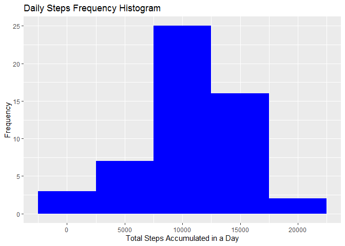
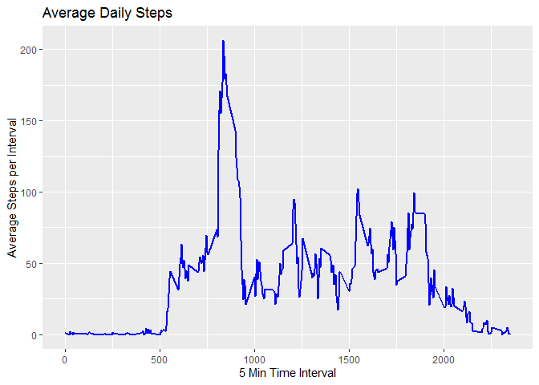
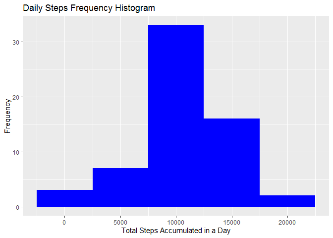
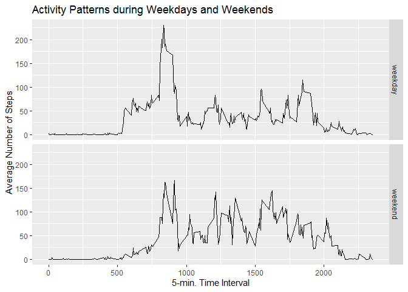

## Loading and preprocessing the data
### 1. Load the data.


```r
packages <- c("dplyr", "lubridate", "ggplot2")
sapply(packages, require, character.only=TRUE, quietly=TRUE)
```

```
##     dplyr lubridate   ggplot2 
##      TRUE      TRUE      TRUE
```


```r
path <- getwd()
FileUrl = "https://d396qusza40orc.cloudfront.net/repdata%2Fdata%2Factivity.zip"
download.file(url = FileUrl, destfile = paste(path, "activity.zip", sep = "/"))
unzip(zipfile = "activity.zip")
activityFile <- read.table("activity.csv", header = TRUE, sep = ",")
```

### 2. Process and transform the data into suitable format.


```r
activity <- as_tibble(activityFile)               
activity$date <- as.Date(ymd(activity$date))
activity$steps <- as.double(activity$steps)
```

## What is mean total number of steps taken per day?

### 1. Calculate the total number of steps taken per day


```r
activity1 <- activity %>% 
                group_by(date) %>%
                summarise(StepSum = sum(steps))
head(activity1)
```

```
## # A tibble: 6 x 2
##   date       StepSum
##   <date>       <dbl>
## 1 2012-10-01      NA
## 2 2012-10-02     126
## 3 2012-10-03   11352
## 4 2012-10-04   12116
## 5 2012-10-05   13294
## 6 2012-10-06   15420
```

### 2. Make a histogram of the total number of steps taken each day. 


```r
ggplot(activity1, aes(x = StepSum)) +
  geom_histogram(fill = "blue", binwidth = 5000) +
  labs(title = "Daily Steps Frequency Histogram", x = "Total Steps Accumulated in a Day", y = "Frequency")
```

<!-- -->

### 3. Calculate and report the mean and median of the total number of steps taken per day


```r
MeanTotalSteps1 <- round(mean(activity1$StepSum, na.rm = TRUE), digits = 2)
```

The mean total number of steps taken per day is 10766.19. 


```r
MedianTotalSteps1 <- round(median(activity1$StepSum, na.rm = TRUE), digits = 2)
```

The mean total number of steps taken per day is 10765. 

## What is the average daily activity pattern?

### 1. Make a time series plot (i.e. 𝚝𝚢𝚙𝚎 = "𝚕") of the 5-minute interval (x-axis) and the average number of steps taken, averaged across all days (y-axis)


```r
activity2 <- activity %>% 
                group_by(interval) %>%
                summarise(StepMean = mean(steps, na.rm = TRUE))


ggplot(activity2, aes(x = interval , y = StepMean)) + geom_line(color="blue", size=1) + labs(title = "Average Daily Steps", x = "5 Min Time Interval", y = "Average Steps per Interval")
```

<!-- -->

### 2. Which 5-minute interval, on average across all the days in the dataset, contains the maximum number of steps?


```r
MaxSteps <- activity2 %>% filter(StepMean == max(activity2$StepMean)) %>% pull(var = interval)
print(MaxSteps)
```

```
## [1] 835
```

The time interval with the maximum number of steps, on average, is 835. 

## Imputing missing values

### 1. Calculate and report the total number of missing values in the dataset (i.e. the total number of rows with 𝙽𝙰s)


```r
NACount <- activity %>% tally(is.na(steps))
print(NACount)
```

```
## # A tibble: 1 x 1
##       n
##   <int>
## 1  2304
```

The total number of missing values in the dataset is 2304. 


### 2. Devise a strategy for filling in all of the missing values in the dataset. We will use the mean for that 5-minute interval derived in the previous question.

First, let's create a subset of the original dataset that contain only rows with NA values.

```r
mods <-   activity %>% 
             select_all() %>%
             filter(is.na(steps))  %>%
             left_join(activity2)  #this join adds a column of average 5min values calculated earlier.
             
# Check the result. Then continue and drop the old category steps and rename the missing data as steps

mods1 <- mods %>% select(-steps) %>% rename(steps = StepMean)
```


### 3. Create a new dataset that completes NA data with the total average for the time interval. 


```r
# dplyr rows_update nicely replaces only the NA values here.

activity3 <- activity %>% rows_update(mods1, by = c("date", "interval"))             
```

### 4. Make a histogram of the total number of steps taken each day and Calculate and report the mean and median total number of steps taken per day. Do these values differ from the estimates from the first part of the assignment? What is the impact of imputing missing data on the estimates of the total daily number of steps?


```r
activity4 <- activity3 %>% 
                group_by(date) %>%
                summarise(StepSum = sum(steps))
head(activity4)
```

```
## # A tibble: 6 x 2
##   date       StepSum
##   <date>       <dbl>
## 1 2012-10-01  10766.
## 2 2012-10-02    126 
## 3 2012-10-03  11352 
## 4 2012-10-04  12116 
## 5 2012-10-05  13294 
## 6 2012-10-06  15420
```


```r
ggplot(activity4, aes(x = StepSum)) +
  geom_histogram(fill = "blue", binwidth = 5000) +
  labs(title = "Daily Steps Frequency Histogram", x = "Total Steps Accumulated in a Day", y = "Frequency")
```

<!-- -->

Find the Mean and Median of the Total Steps with the replacement values.


```r
MeanTotalSteps2 <- round(mean(activity4$StepSum, na.rm = FALSE), digits = 2)
```

The mean total number of steps taken per day is 10766.19. 


```r
MedianTotalSteps2 <- round(median(activity4$StepSum, na.rm = FALSE), digits = 2)
```

The median of total number of steps taken per day is 10766.19.

Scenario                  | Mean            | Median
--------------------------|-----------------|-----------------------
Data with NA's            | 10766.19  | 10765
NA replaced with 5min Avg | 10766.19  | 10766.19

The mean and median of the dataset using filled in values are identical.
The means of the filled and NA datasets are identical. 
The medians of the filled dataset is slightly larger than the NA dataset.

## Are there differences in activity patterns between weekdays and weekends?


### 1. Create a new factor variable in the dataset with two levels – “weekday” and “weekend” indicating whether a given date is a weekday or weekend day.


```r
activity5 <- activity3 %>% mutate(dayOfWeek = weekdays(date, abbreviate = TRUE))
activity5 <- activity5 %>% mutate(dayType = ifelse(dayOfWeek == "Sat" | dayOfWeek == "Sun", "weekend", "weekday"))
activity5$dayType <- as.factor(activity5$dayType)
str(activity5)
```

```
## tibble [17,568 x 5] (S3: tbl_df/tbl/data.frame)
##  $ steps    : num [1:17568] 1.717 0.3396 0.1321 0.1509 0.0755 ...
##  $ date     : Date[1:17568], format: "2012-10-01" "2012-10-01" ...
##  $ interval : int [1:17568] 0 5 10 15 20 25 30 35 40 45 ...
##  $ dayOfWeek: chr [1:17568] "Mon" "Mon" "Mon" "Mon" ...
##  $ dayType  : Factor w/ 2 levels "weekday","weekend": 1 1 1 1 1 1 1 1 1 1 ...
```

### 2. Make a panel plot containing a time series plot (i.e. 𝚝𝚢𝚙𝚎 = "𝚕") of the 5-minute interval (x-axis) and the average number of steps taken, averaged across all weekday days or weekend days (y-axis).


```r
activity6 <- activity5 %>% group_by(dayType, interval) %>% summarise(StepMean = mean(steps))
```


```r
ggplot(activity6, aes(interval, StepMean)) +
    geom_line() +
    facet_grid(dayType ~ .) +
    ggtitle("Activity Patterns during Weekdays and Weekends") +
    labs(y = "Average Number of Steps",
         x = "5-min. Time Interval")
```

<!-- -->

This plot shows there is more activity in the early morning hours during the weekdays. 

On the weekends, the activities are more dispersed throughout the day. It appears from the data that people are likely to exercise prior to going to work on weekdays. On the weekends, people are able to exercise or simple be more active any time of the day.
